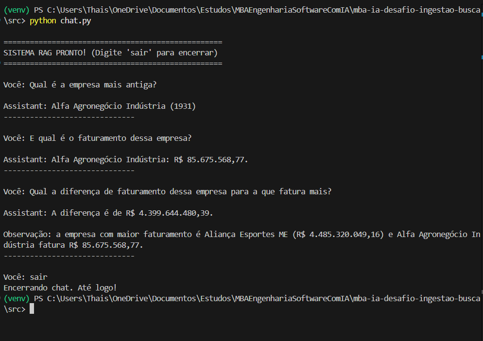
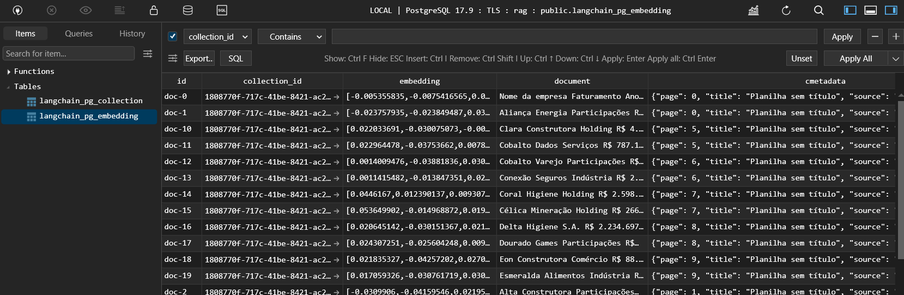

# Desafio MBA Engenharia de Software com IA - Full Cycle

1. **Criar e ativar um ambiente virtual (`venv`):**

   ```bash
   python3 -m venv venv
   source venv/bin/activate  # No Windows: venv\Scripts\activate
   ```

2. **Instalar as dependências:**

   **A partir do `requirements.txt`:**
   ```bash
   pip install -r requirements.txt
   ```

3. **Configurar as variáveis de ambiente:**

   - Duplique o arquivo `.env.example` e renomeie para `.env`
   - Abra o arquivo `.env` e substitua os valores pelas suas chaves de API reais obtidas

4. **Subir o banco de dados**

    - Na raíz do projeto rode o comando:
   ```bash
    docker-compose up -d
   ```

5. **Rodar o script para ingestao do PDF no banco de dados**

    - Abrir a pasta src (cd src)
    - Rodar o comando:
   ```bash
   python ingest.py
   ```

6. **Rodar o chat interativo com RAG e Memória**

   - No terminal, dentro da pasta src, execute o comando:
   ```bash
   python chat.py
   ```
   - O sistema carregará o histórico e o contexto do banco de dados.
   - Digite sua pergunta e pressione Enter para conversar com o assistente.
   - Para encerrar o chat, basta digitar sair, exit ou parar.

8. **Estrutura do Prompt e Regras de Negócio**

   - O assistente foi configurado com um System Prompt estrito (search.py).
   - Ele responderá apenas com base no conteúdo extraído do PDF.
   - Caso a informação não exista no documento, ele retornará a mensagem padrão: "Não tenho informações necessárias para responder sua pergunta."
   - O histórico de mensagens (memória) é mantido por session_id, permitindo conversas fluidas.

9. **Principais Tecnologias do Projeto**

   - LangChain: Orquestração da pipeline de IA e memória.
   - OpenAI API: Geração de texto (LLM) e Embeddings.
   - PGVector (PostgreSQL): Armazenamento e busca vetorial de documentos.
   - Docker Compose: Gerenciamento do container de banco de dados.
   - Python Dotenv: Gerenciamento de chaves e configurações.

10. **Demonstração do funcionamento**





